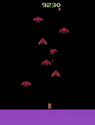
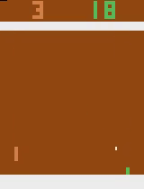
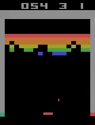
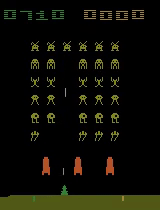
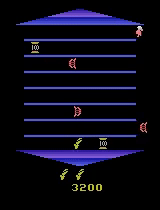

# Increasing the Action Gap : New Operators for Reinforcement Learning

Pytorch implementation of the Persistent Advantage learning operator proposed in [Increasing the Action Gap: New Operators for Reinforcement Learning](https://arxiv.org/abs/1512.04860) . This repository includes the source code for training, demo and action gap visualization, and trained models with 3 learning operators for 5 Atari games.

## Results

- Persistent Advantage Learning operator on 5 games : Phoenix, Pong, Breakout, SpaceInvaders and Asterix

## Requirements

- python 3.5
- [gym](https://github.com/openai/gym#installation) 
- [pytorch](https://github.com/pytorch/pytorch#from-source)

## Implementation Details

- `src` directory,
  -  To train model, set the environment name in `main.py`. In `dqn_learn.py`, set the error according to the operator with which you want to train. Set the hyperparameters and run `python3 main.py` inside `src` directory.
  -  In `tmp` directory, the results and videos by gym monitor are stored. You can change this directory  while wrapping `Monitor` wrapper on environment.
  -  `models` directory stores the  trained models. Saved models can be used to visualize action gap or do a test run. Rewards per episode while training are stored in `statistics.pkl`. 
- `demo_src` directory,
  - `main_traj.py` can be used to run one test episode with trained model. It will also store the observed states which can later be used to plot action gap. Set the environment name (game name) in `main_traj.py`  and run it. Make sure that you have trained model with appropriate name in `models` directory.
  - `main_actiongap.py` can be used to run normal DQN, AL and PAL for an episode to store the action gap which can be visualized later. First run `main_traj.py` with appropriate game name to store an episode. Then run `main_actiongap.py` with the same game name. It will store the actiongap for all 3 operators in a pickle file.
  - `actiongap_plot.py` can be used to plot saved actiongap. 
- `results` directory,
  - `videos` contains the videos for 5 Atari games on which I have trained Persistent Advantage Learning (PAL) operator. First video is taken at the start of the training and second video is taken after training.
  - `plots` includes the plotted results by my training and authors' results.

## Report

- `report.pdf` has indepth analysis of the paper and obtained results. It includes the results obtained by authors which aligns with my results.
- `presentation.pdf` was used to present the project and results.

## Credit

This implementation is inspired from <https://github.com/berkeleydeeprlcourse/homework/tree/master/hw3>

### TODO

- Source code has some code duplication which can be removed and restructured.
